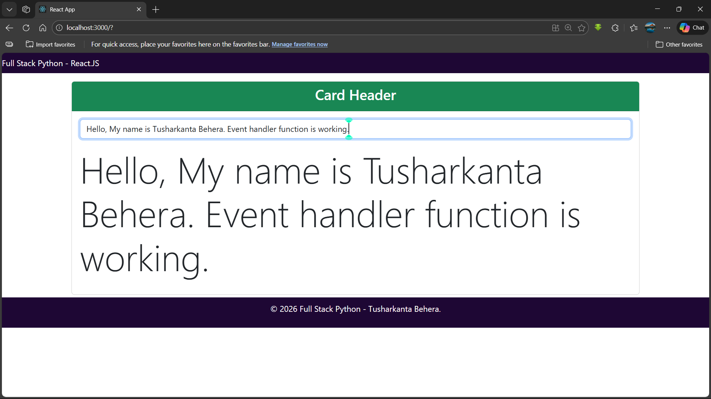

# React Interactive Text Display App

A simple and elegant React.js application that demonstrates real-time text input handling and dynamic content rendering using React Hooks. This project showcases the fundamentals of React event handling, state management, and component-based architecture.

## 📸 Screenshots

### Application Output



## 📋 Table of Contents

- [Overview](#overview)
- [Features](#features)
- [Technologies Used](#technologies-used)
- [Project Structure](#project-structure)
- [Installation](#installation)
- [Usage](#usage)
- [Screenshots](#screenshots)
- [Learning Objectives](#learning-objectives)
- [Author](#author)

## 🎯 Overview

This application demonstrates a real-time text display feature where users can type into an input field and see their text rendered dynamically on the screen in large font. It's built with React.js and Bootstrap, making it a perfect starter project for learning React concepts.

## ✨ Features

- **Real-time Text Display**: As you type in the input field, your text is immediately displayed below in large format
- **React Hooks Implementation**: Uses `useState` hook for state management
- **Event Handling**: Demonstrates React's `onChange` event handling
- **Responsive Design**: Built with Bootstrap 5 for mobile-friendly layout
- **Component-Based Architecture**: Organized into reusable Navbar, Card, and Footer components
- **Clean UI**: Simple and intuitive user interface with a professional look

## 🛠️ Technologies Used

- **React.js** (v19.2.4) - Frontend JavaScript library
- **Bootstrap** (v5.3.8) - CSS framework for styling
- **Create React App** - Initial project setup
- **JavaScript ES6+** - Modern JavaScript features
- **HTML5** & **CSS3** - Markup and styling

## 📁 Project Structure

```
project7/
├── public/
│   ├── index.html
│   ├── manifest.json
│   └── robots.txt
├── src/
│   ├── Components/
│   │   ├── Card.js          # Main card component with input and display
│   │   ├── Navbar.js        # Navigation bar component
│   │   └── Footer.js        # Footer component
│   ├── App.js               # Main application component
│   ├── App.css              # Application styles
│   ├── index.js             # Entry point
│   └── index.css            # Global styles
├── package.json
└── README.md
```

## 🚀 Installation

Follow these steps to set up and run the project locally:

### Prerequisites

- Node.js (v14 or higher)
- npm (Node Package Manager)

### Steps

1. **Clone the repository**

   ```bash
   git clone <repository-url>
   cd project7
   ```

2. **Install dependencies**

   ```bash
   npm install
   ```

3. **Start the development server**

   ```bash
   npm start
   ```

4. **Open your browser**

   The app will automatically open at [http://localhost:3000](http://localhost:3000)

## 💻 Usage

1. Open the application in your browser
2. Type any text in the input field labeled "Enter Your Content"
3. Watch as your text appears dynamically in large display format below the input
4. The application demonstrates real-time state management and event handling


_The application displays a clean interface with a green header, input field, and dynamically rendered text output._

> **Note**: To add the screenshot, save your screenshot as `screenshot.png` in the root directory of the project.

## 🎓 Learning Objectives

This project covers the following React.js concepts:

- **React Hooks**: Implementation of `useState` for managing component state
- **Event Handling**: Using `onChange` event to capture user input
- **Component Composition**: Breaking down UI into reusable components
- **Props and State**: Understanding component data flow
- **JSX Syntax**: Writing HTML-like syntax in JavaScript
- **Bootstrap Integration**: Using external CSS frameworks with React

## 📝 Available Scripts

In the project directory, you can run:

### `npm start`

Runs the app in development mode. Open [http://localhost:3000](http://localhost:3000) to view it in your browser.

### `npm test`

Launches the test runner in interactive watch mode.

### `npm run build`

Builds the app for production to the `build` folder. The build is optimized for the best performance.

## 👨‍💻 Author

**Tusharkanta Behera**

Full Stack Python & React Developer

---

## 📄 License

This project was bootstrapped with [Create React App](https://github.com/facebook/create-react-app).

---

**© 2026 Full Stack Python - Tusharkanta Behera**

### Analyzing the Bundle Size

This section has moved here: [https://facebook.github.io/create-react-app/docs/analyzing-the-bundle-size](https://facebook.github.io/create-react-app/docs/analyzing-the-bundle-size)

### Making a Progressive Web App

This section has moved here: [https://facebook.github.io/create-react-app/docs/making-a-progressive-web-app](https://facebook.github.io/create-react-app/docs/making-a-progressive-web-app)

### Advanced Configuration

This section has moved here: [https://facebook.github.io/create-react-app/docs/advanced-configuration](https://facebook.github.io/create-react-app/docs/advanced-configuration)

### Deployment

This section has moved here: [https://facebook.github.io/create-react-app/docs/deployment](https://facebook.github.io/create-react-app/docs/deployment)

### `npm run build` fails to minify

This section has moved here: [https://facebook.github.io/create-react-app/docs/troubleshooting#npm-run-build-fails-to-minify](https://facebook.github.io/create-react-app/docs/troubleshooting#npm-run-build-fails-to-minify)
